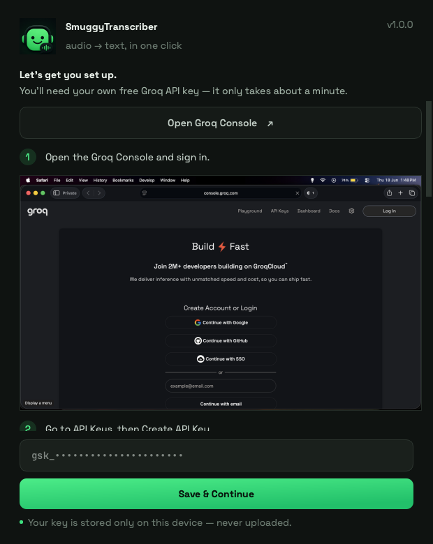
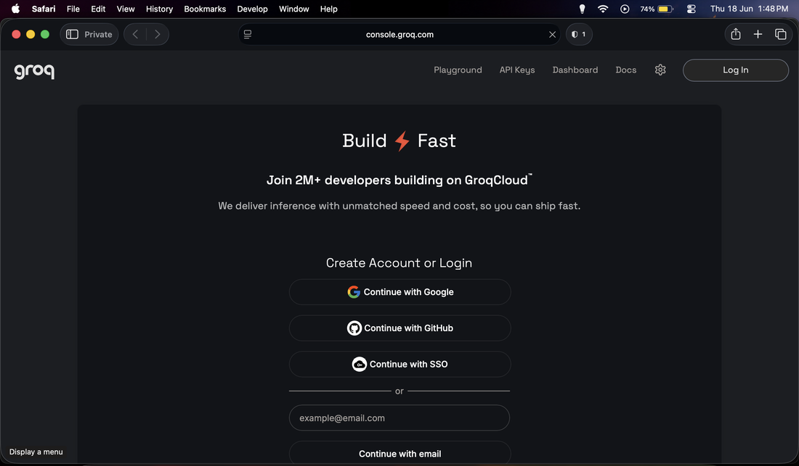
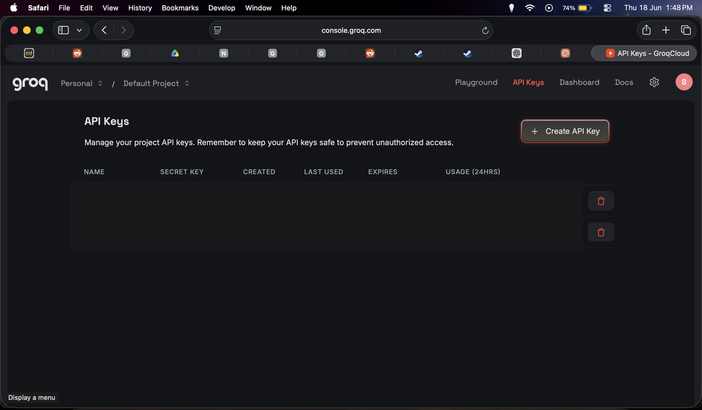
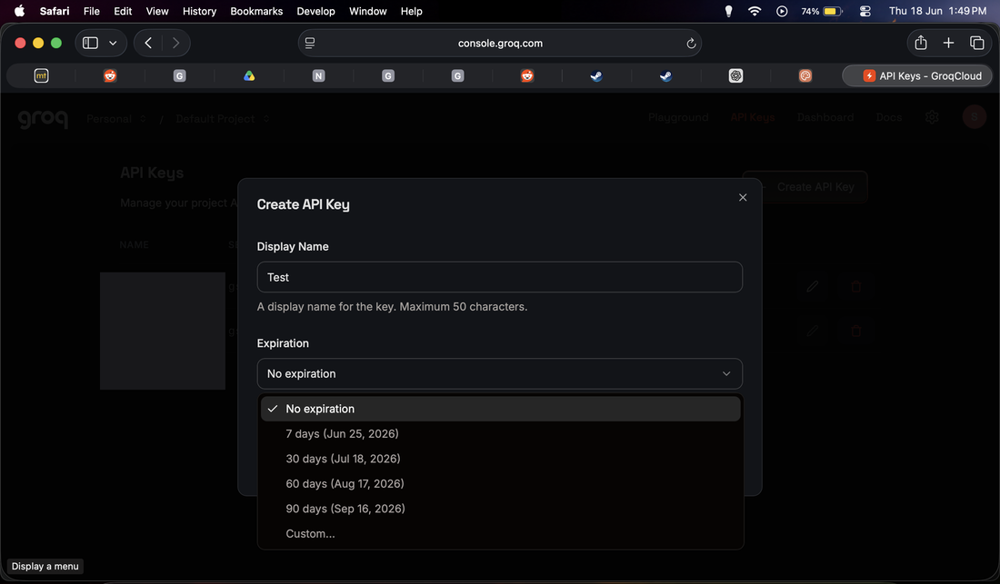
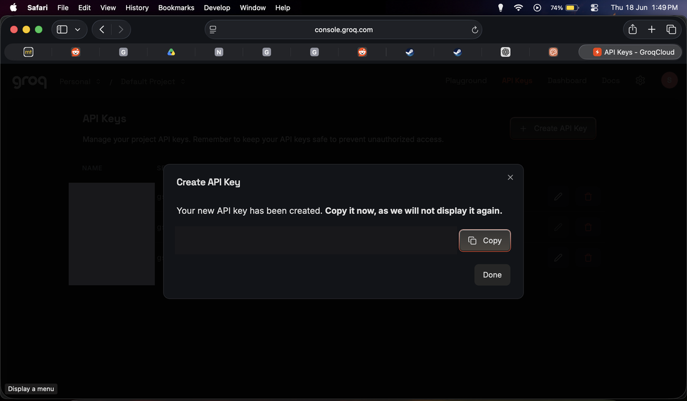

# SmuggyTranscriber

A dead-simple desktop app that turns an audio file into text using Groq's
`whisper-large-v3`. Pick a file, click **Transcribe**, then **Copy** or
**Save as .txt**. Auto-detects the language (Hindi, English, Hinglish, and
more), with an optional language selector.

<p align="center">
  
</p>

---

## For users (Windows)

1. Download **`SmuggyTranscriber.exe`** from the [Releases](../../releases) page.
2. Double-click it.
   - Windows may show a **SmartScreen** warning because the app isn't code-signed.
     Click **More info → Run anyway**. (It's safe — it's just unsigned.)
3. The first time, it asks for a **Groq API key**, and walks you through getting one
   (see below). Your key is stored privately on your own machine — it's never
   shared or uploaded anywhere but to Groq.
4. Click **Choose audio file…**, pick the **Language** (or leave on Auto), and click **Transcribe**.
5. Use **Copy** or **Save as .txt** for the result.

> Max file size is **25 MB** (Groq's limit). Supported formats include
> `.mp3`, `.wav`, `.m4a`, `.ogg`, `.webm`, `.mp4`, `.flac`.

### Getting your free Groq API key

The app shows these same steps on first run. Head to
[console.groq.com](https://console.groq.com) and:

**1. Sign in** (or create a free account).



**2. Open API Keys**, then click **Create API Key**.



**3. Give it any name** and click **Submit**.



**4. Copy the key** — it starts with `gsk_` and is shown only once. Paste it into
the app and click **Save & Continue**.



---

## For developers

### Run it

```bash
python -m venv venv
venv\Scripts\activate          # Windows
# source venv/bin/activate     # macOS/Linux

pip install -r requirements.txt
python app.py
```

For dev convenience, the app also reads `GROQ_API_KEY` from a `.env` file
(copy `.env.example` to `.env`), so you don't have to paste a key each run.
A real, saved key always takes precedence over the env var.

### Command-line version

`transcribe.py` is a tiny CLI that transcribes a hardcoded file. It shares
its Groq logic with the app via `core.py`:

```bash
python transcribe.py    # transcribes ReelAudio-39184.mp3 -> transcription.txt
```

### Project layout

| File          | Purpose                                                        |
| ------------- | -------------------------------------------------------------- |
| `core.py`     | GUI-free logic: key validation + transcription (unit-testable) |
| `settings.py` | Per-user key storage via `QSettings`                           |
| `app.py`      | PySide6 GUI (setup screen + main screen, threaded transcribe)  |
| `transcribe.py` | CLI, imports from `core.py`                                  |

### How the apps are built

A GitHub Actions workflow ([`.github/workflows/build.yml`](.github/workflows/build.yml))
packages the app with PyInstaller (`--onefile --windowed --name SmuggyTranscriber`)
on two runners in parallel:

- **Windows** (`windows-latest`) → `SmuggyTranscriber.exe`
- **macOS** (`macos-latest`) → `SmuggyTranscriber.app`, zipped with `ditto`
  into `SmuggyTranscriber-macos.zip`

On every push to `main` each build is uploaded as a **workflow artifact**
(`SmuggyTranscriber-windows` / `SmuggyTranscriber-macos`). Pushing a `v*` tag
(e.g. `git tag v1.0 && git push --tags`) also attaches both to a GitHub
**Release** for users to download. No Windows or Mac machine is needed to
build — the runners do it.

> The macOS `.app` is unsigned, so the first launch needs **right-click → Open**
> (or **System Settings → Privacy & Security → Open Anyway**) to get past
> Gatekeeper — the Mac equivalent of the Windows SmartScreen prompt.
